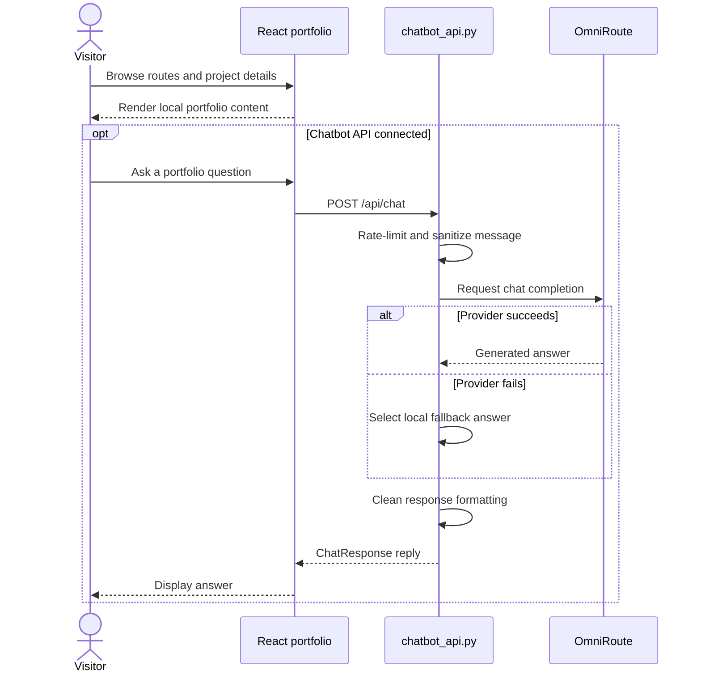

# Ibrahim Abdelsattar — Portfolio

A React portfolio presenting AI and data science projects, professional background, certifications, and contact information, with a separate conversational assistant backend.

**Technology:** React 18 · TypeScript · Vite · Tailwind CSS · Framer Motion · FastAPI

## Features

- Navigate home, about, project catalog, project details, certifications, and contact pages.
- Display project cards and supporting portfolio assets.
- Provide an interactive chatbot UI connected to the separate FastAPI service.
- Include archived datasets and notebooks from selected portfolio projects.

## Repository guide

| Path | Purpose |
|---|---|
| [src/App.tsx](src/App.tsx) | Portfolio routes. |
| [src/pages](src/pages) | Portfolio pages. |
| [src/components](src/components) | UI and chatbot components. |
| [public](public) | Public assets and resume. |
| [chatbot_api.py](chatbot_api.py) | FastAPI conversational endpoint. |
| [package.json](package.json) | Frontend scripts and dependencies. |

## Requirements and current limitations

Portfolio project content is maintained in the frontend source; the presence of another project's notebook or dataset here does not make it part of the website's runtime. A separate `agent_server.py` exists, but it is not needed for the documented portfolio launch.

## UML diagrams

### Main workflow

Portfolio navigation runs in React. The optional chat request reaches FastAPI, which uses OmniRoute and falls back to local portfolio answers if the provider call fails.



## Getting started

```bash
git clone https://github.com/IbrahimAbdelsattar/Ibrahim-Portfolio.git
cd Ibrahim-Portfolio
```

```bash
npm install
npm run dev
```

Open the local origin printed by the development server.

### Available scripts

| Command | Purpose |
|---|---|
| `npm run build` | Create a production build. |
| `npm run lint` | Run the configured lint/type checks. |
| `npm run preview` | Preview the Vite production build. |

## Optional chatbot API

The API is separate from the Vite development server:

```bash
python -m pip install fastapi uvicorn
python -m uvicorn chatbot_api:app --reload --port 8000
```

The service exposes `POST /api/chat` and `GET /health`. Check the API address used in `src/components/IbrahimChatbot.tsx` and the model/provider settings in `chatbot_api.py` before connecting a local frontend. Provider access is an additional runtime dependency.
