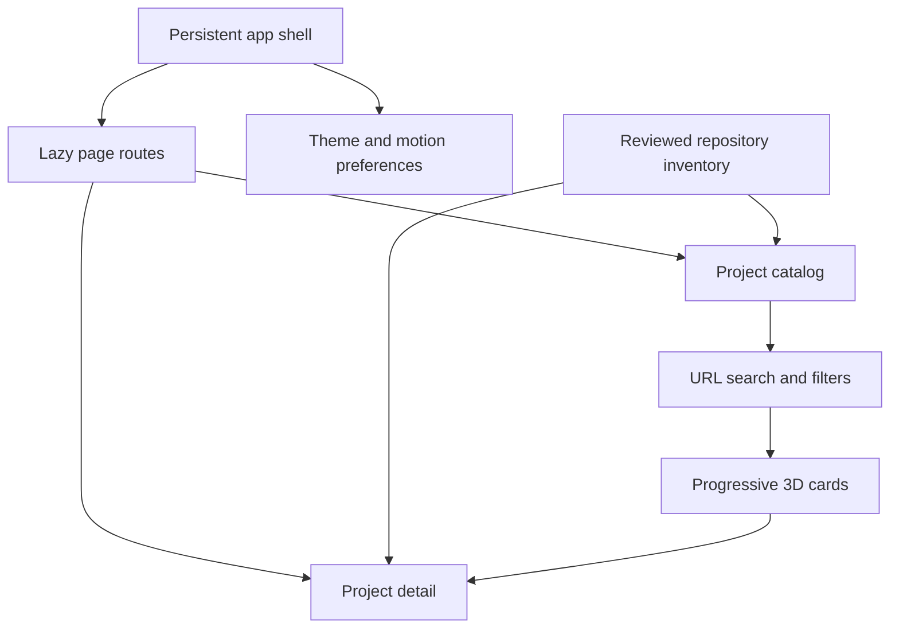
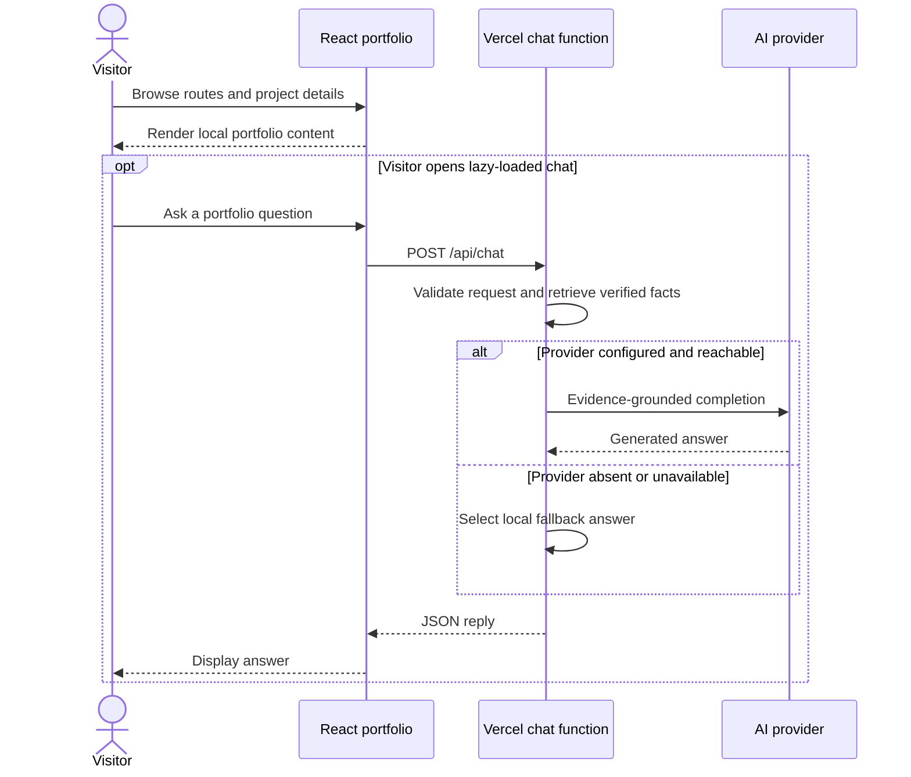

# Ibrahim Abdelsattar — Portfolio

A React portfolio presenting AI and data science projects, professional background, certifications, and a grounded AI persona that answers in Ibrahim's first-person voice.

**Technology:** React 18 · TypeScript · Vite · Tailwind CSS · Framer Motion · Vercel Functions

## Features

- Navigate home, about, project catalog, project details, certifications, and contact pages.
- Explore all 60 owned GitHub repositories (42 public, 18 private), with upstream attribution for 9 forks.
- Search repository names and technologies, filter categories and source type, and share filtered URLs.
- Open a dedicated detail route for each entry; load the catalog in batches of 12.
- Use the Sapphire Veil palette (`#E7F0FA`, `#7BA4D0`, `#2E5E99`, `#0D2440`) in light and dark themes.
- Interact with spring-driven 3D cards, pointer-responsive particles, and route transitions. Motion adapts to touch devices and live reduced-motion preferences, pauses background work in hidden tabs, and gives scrolling priority over decorative canvas updates.
- Load the chat UI on demand and ask in English or Arabic. Its verified knowledge uses the same profile as About and the full repository catalog, including fork attribution and private-source summaries.
- Present the current Full Stack AI Engineer role at EFS, June 2026 to present, alongside the earlier professional experience.
- Include archived datasets and notebooks from selected portfolio projects.

## Repository guide

| Path | Purpose |
|---|---|
| [src/App.tsx](src/App.tsx) | Portfolio routes. |
| [src/pages](src/pages) | Portfolio pages. |
| [src/components](src/components) | UI and chatbot components. |
| [public](public) | Public assets and resume. |
| [src/data/profile.ts](src/data/profile.ts) | Shared public employment, education, contact details, and skills. |
| [src/data/ibrahimKnowledge.ts](src/data/ibrahimKnowledge.ts) | Grounding, repository retrieval, and bilingual local answers. |
| [api/chat.ts](api/chat.ts) | Same-origin Vercel conversational endpoint. |
| [package.json](package.json) | Frontend scripts and dependencies. |

## Requirements and current limitations

The catalog is a reviewed snapshot of the account, not a live GitHub API feed. Update `src/data/projects.ts` and the inventory test fixture when repositories change. Private entries show portfolio summaries without public source links; forks identify their upstream authors.

Portfolio project content is maintained in the source; the presence of another project's notebook or dataset here does not make it part of the website's runtime. Legacy Python services remain independent and are not required by this website.

The persona represents published facts rather than all private knowledge about Ibrahim. It identifies itself as AI, keeps unpublished EFS responsibilities unknown, and does not infer salaries, client details, availability, or performance claims. Update the shared profile when those public facts change.

## UI architecture



## UML diagrams

### Main workflow

Portfolio navigation runs in React. Chat requests reach the same-origin Vercel function. The function uses verified profile and repository evidence with an optional OmniRoute connection or Vercel AI Gateway, and returns local grounded answers if generation is unavailable. The browser also provides those answers when the function is unavailable. Each answer identifies whether it was generated or came from the verified profile.



## Getting started

```bash
git clone https://github.com/IbrahimAbdelsattar/Ibrahim-Portfolio.git
cd Ibrahim-Portfolio
```

```bash
npm ci
npm run dev
```

Open the local origin printed by the development server.

### Available scripts

| Command | Purpose |
|---|---|
| `npm run build` | Create a production build. |
| `npm run lint` | Run ESLint. |
| `npm run typecheck` | Check frontend and API TypeScript. |
| `npm test` | Check catalog coverage, attribution, privacy, persona grounding, follow-ups, and API failure handling. Requires Node 22.18+ or 24. |
| `npm run preview` | Preview the Vite production build. |

## Chat runtime

Deploy the repository to Vercel to run `api/chat.ts` with the frontend, or use `vercel dev` locally. A plain Vite server or static preview uses the browser's grounded fallback.

On Vercel, generated replies can authenticate to AI Gateway with the deployment's automatic `VERCEL_OIDC_TOKEN`, without a permanent API key. AI Gateway access and credits must be available on the linked team. The default model is `google/gemini-3.1-flash-lite`; set `AI_GATEWAY_MODEL` to override it. A server-only `AI_GATEWAY_API_KEY` takes precedence over OIDC when configured, and works for development outside Vercel.

An existing `OMNIROUTE_API_KEY` connection is tried first, using `OMNIROUTE_MODEL` (default: `gh/gpt-4o-mini`), then Vercel AI Gateway if available. The function can reuse an existing `VITE_OMNIROUTE_API_KEY` on the server for migration; frontend code never reads it. Use the server-only name for new configuration. The entire generation attempt is bounded to 8.5 seconds, and verified profile answers require no provider key. Operational logs include only provider names and failure categories or HTTP status, never prompts, credentials, or provider error bodies.

`GET /api/chat` reports readiness; `POST /api/chat` accepts a message and up to eight conversation turns. Replies are not cached or persisted. Requests have bounded size, a provider timeout, and a best-effort per-instance IP rate limit; this limit is not a globally distributed quota.
